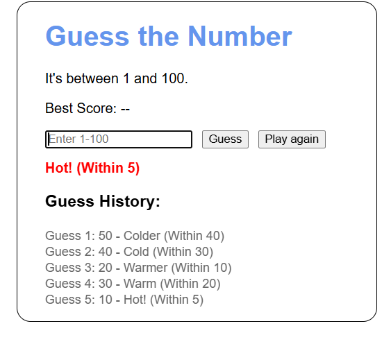
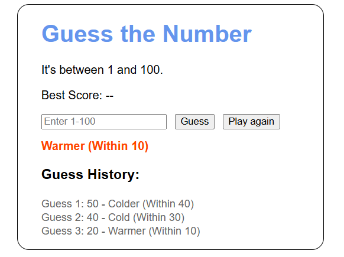
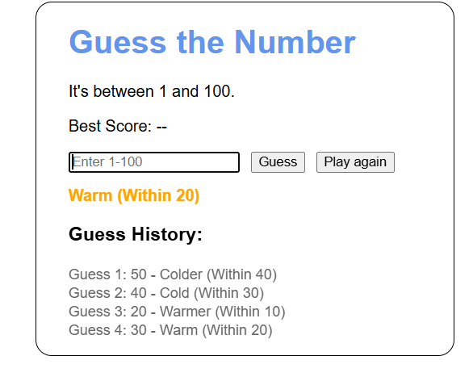
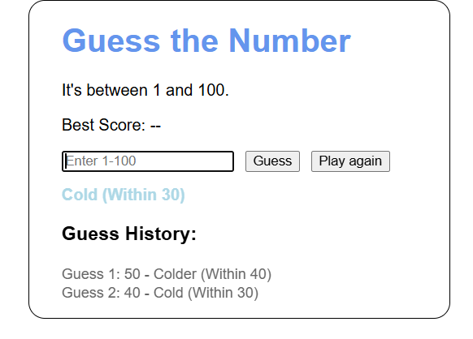
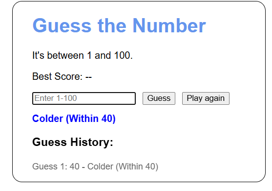
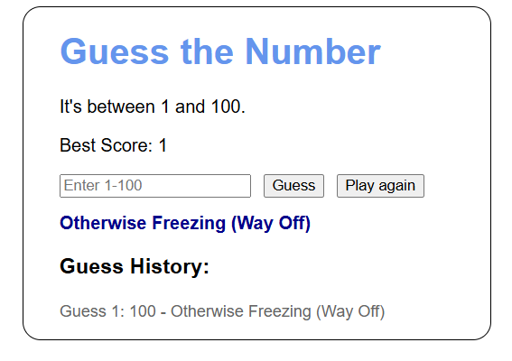
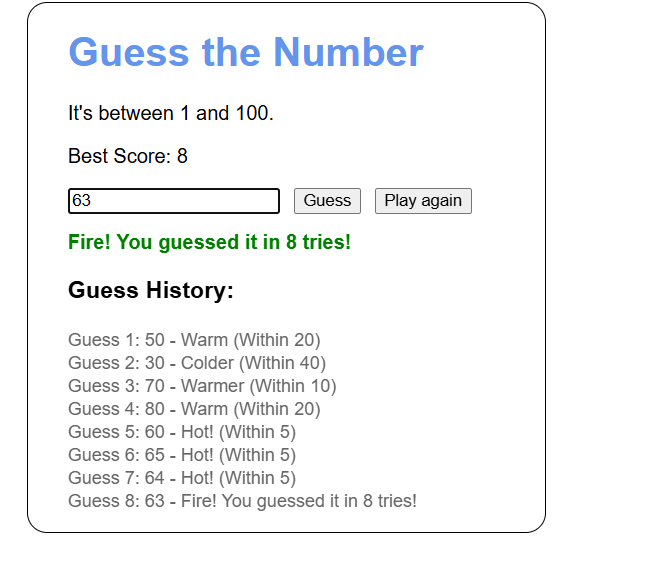

# Guessing Game

<b>Table of Contents</b>
- [Summary](#summary)
- [Screenshots](#screenshots)
  - [Hot](#hot)
  - [Warmer](#warmer)
  - [Warm](#warm)
  - [Cold](#cold)
  - [Colder](#colder)
  - [Freezing](#freezing)
  - [Fire](#fire)
- [Maintainers](#maintainers)

## Summary
Welcome to the Hot & Cold Guessing Game.
----------------------------------------
Here you will be guessing between the numbers 1 & 100.
 
This Guessing Game is a fun hot/cold game that will signal when your far or close to the 
number!

## ScreenShots
### Hot

### Warmer

### Warm

### Cold

### Colder

### Freezing

### Fire

### Maintainers
[@tarath01](https://github.com/tarath01) Taylor Rath  

[Back to the Top](#guessing-game)
